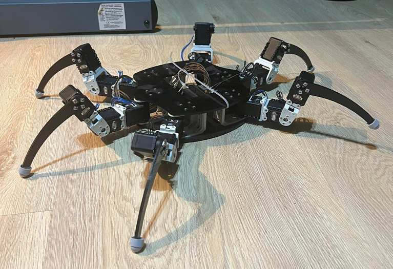
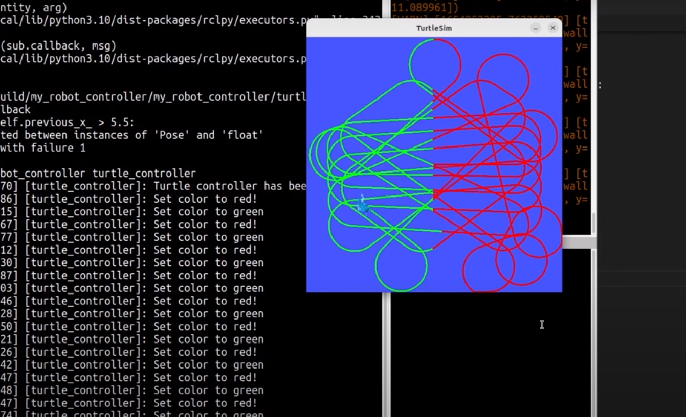
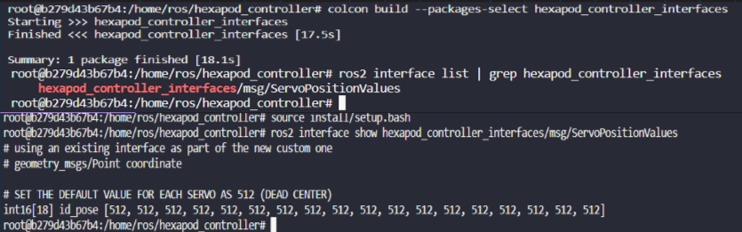
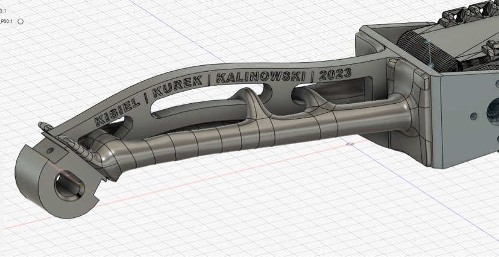
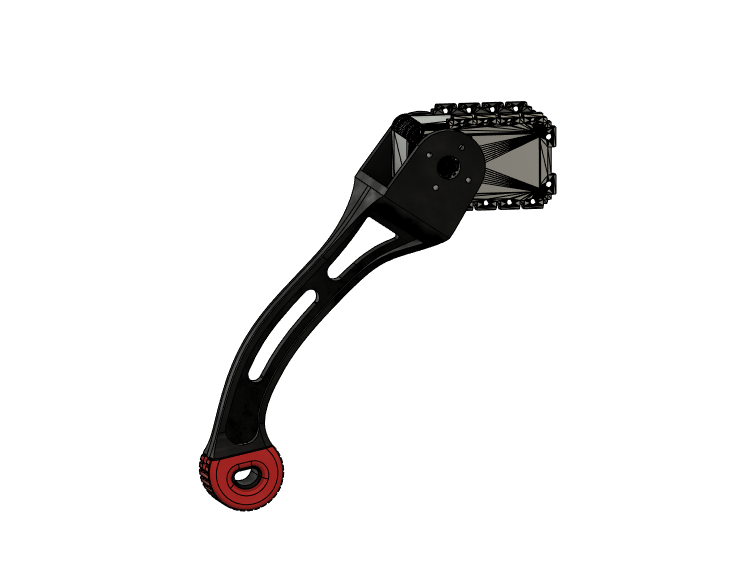
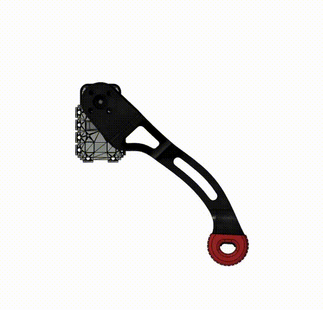
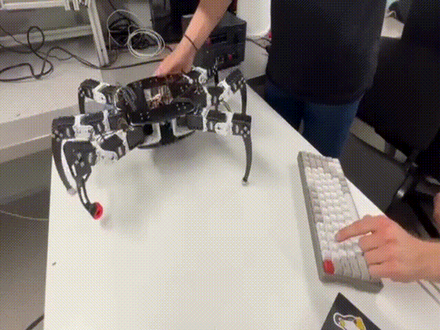

# HEXAPOD Robot 🤖🕷

  
  
   
  
  

---

## Choose your language

<table align="center" text-align="center">
<thead><th align="center">

#### EN

</th><th>&emsp;&emsp;</th><th align="center">

#### PL

</th></thead>
<tbody>
<tr><td align="center">

[Read the QuickStart Guide in English (EN)](./docs/QUICKSTART_GUIDE_EN.md)

<!-- |README|QuickStart Guide|
|:-:|:-:|
|[Read the README in English (EN)](./docs/README.md)|[Read the QuickStart Guide in English (EN)](./docs/QUICKSTART_GUIDE_EN.md)| -->
</td><td>&emsp;</td><td align="center">

[Przeczytaj QuickStart Guide po polsku (PL)](./docs/QUICKSTART_GUIDE_PL.md)

<!-- |README|QuickStart Guide|
|:-:|:-:|
|[Przeczytaj README po polsku (PL)](./docs/README_PL.md)|[Przeczytaj QuickStart Guide po polsku (PL)](./docs/QUICKSTART_GUIDE_PL.md)| -->
</td></tr>
<tr><td align="center">

[Read the README in English (EN)](./docs/README.md)

</td><td>&emsp;</td><td align="center">

[Przeczytaj README po polsku (PL)](./docs/README_PL.md)

</td></tr>
</tbody>
</table>

---

## Table of Contents
* [About](https://github.com/revalew/HEXAPOD/tree/master#about)
* [Progress report](https://github.com/revalew/HEXAPOD/tree/master#progress-report)
  * [First success](https://github.com/revalew/HEXAPOD/tree/master#first-success)
  * [Successful connection](https://github.com/revalew/HEXAPOD/tree/master#successful-connection)
  * [First Stand up](https://github.com/revalew/HEXAPOD/tree/master#first-stand-up)
  * [Controlling all of the servos w/ Inverse Kinematics](https://github.com/revalew/HEXAPOD/tree/master#controlling-all-of-the-servos-w-inverse-kinematics)
  * [First walk](https://github.com/revalew/HEXAPOD/tree/master#first-walk)
  * [Our own leg design](https://github.com/revalew/HEXAPOD/tree/master#our-own-leg-design)
  * [Teleoperating HEXAPOD with a keyboard](https://github.com/revalew/HEXAPOD/tree/master#teleoperating-hexapod-with-a-keyboard)
  * [Improved the code structure by adding the robot state machine](https://github.com/revalew/HEXAPOD/tree/master#improved-the-code-structure-by-adding-the-robot-state-machine)
  * [Controlling the battery powered robot wirelessly](https://github.com/revalew/HEXAPOD/tree/master#controlling-the-battery-powered-robot-wirelessly)
  * [Adding the private Access Point](https://github.com/revalew/HEXAPOD/tree/master#adding-the-private-access-point)
* [Issues & plans](https://github.com/revalew/HEXAPOD/tree/master#issues--plans)
  * [Current problems](https://github.com/revalew/HEXAPOD/tree/master#current-problems)
  * [Future improvements and plans of development](https://github.com/revalew/HEXAPOD/tree/master#future-improvements-and-plans-of-development)

## About
This is the repository of the academic project which my friends and I are developing. By any means is it perfect, but we will work **HARD** to improve the functionality and make it work! 

What we want to achieve:

- Develop a functional control system for the **HEXAPOD** robot,
- Learn more about Raspberry Pi (i.e. HALF-Duplex UART communication),
- Learn about ROS2 software,
- Learn about Docker and contenerized environments,
- Learn about robotics (especially inverse kinematics),
- Learn about OOP programming in python and ROS2,
- Learn how to use Git & GitHub to collaborate.

## Progress report

### First success:
We created a closed loop control system utilizing:
- Publisher node,
- Subscriber node,
- ROS2 service,
- Turtlesim demo.

  

----

### Successful connection:
We managed to connect the servos and made sure that all 18 of them were working! 🥳

  

----

### First Stand up:
After few attempts HEXAPOD can finaly stand up easily! Still a lot of work to do, but we are ready to migrate the prototype Python scripts to ROS2 to control all of the servos simultaneously.

  

----

### Controlling all of the servos w/ Inverse Kinematics:
Many hours and iterations later we finally managed to use the ROS2 capabilities to move every leg simultaneously! To achieve this we used:
- improved code structure - we moved every leg into one file and made separate functions for each leg,
- custom interface, which is basically an array of positions for the servos,
- different packet structure for controlling the servos - we used a DynamixelSDK's class called "GroupSyncWrite" to minimize the number of the messages sent (just 6 now!),
- launch file, which spawns a separate process for each of the legs and for the body, allowing us to execute them at the same time.

  
  &ensp;
  
   
  

----

### First walk:
After a while, we implemented the leg trajectory calculation using the inverse kinematics of the leg and succesfully added a gait pattern. For now, we use only one walking pattern, but we may need more in the future, so we prepared the code's architecture for this scenario. Right now, we want to improve the speed of UART communication to move faster or change the ROS publisher / subscriber to services.

Summary:
- implemented leg trajectory and gait patterns,
- added custom messages, e.g. controll_status to monitor the status of the robot in the future,
- changed the code's architecture.

  
  

----

### Our own leg design:
Because of the problems we were having with the current leg design, we decided to make a new one. The legs we were using were very slippery, so the robot was struggling and sliding all over the table. The new design aims to solve this problem by adding rubber feet. The first thing we tried was generative design, but it turned out to be really difficult to print with our current 3D printer and our knowledge of printing in general.
We then moved to a simpler design, but as always we forgot something and this time the design was flawed because it only allowed the angle to change in a range of 0-180 degrees.
We quickly fixed the angle limitation problem. We changed the length of the leefs that attach the leg to the servo and slightly modified the shape and now everything looks amazing. Now we can try them out in real life and see if this helps to solve the lack of friction problem.

  
  
   
  

----

### Teleoperating HEXAPOD with a keyboard:
After improving the walking algorithm we were finally able to implement the teleop of the HEXAPOD and the results exceeded our expectations. Everything went smoothly and we were able to move the robot using a keyboard. We can now control the parameters that define the body (translation and rotation) and change the direction in which we want to walk. The best thing is that we can now easily combine walking and changing the position of the body! This allows us to walk with a rotated body or walk over/under different objects. This was also the first real life test of our newly designed leg, and now we know that... we have to redesign it again because the silicone feet are not properly angled. The feet are also very stiff, so we want to address that as well. We also have another idea to improve the shape of the leg, so we will be testing many different things in the coming weeks.

  
  

----

### Improved the code structure by adding the robot state machine
After struggling with the code structure we decided to implement the state machine.  At the moment we have only implemented the basic functionality, but we plan to improve the idea in the future. We added the following states:
- idle - stop the robot and wait for a change of the state (next command),
- walk - start walking in the given direction,
- rotate_left - start rotating the robot counter-clockwise,
- rotate_right - start rotating the robot clockwise,
- body_manipulation - stop and change the position of the body (translation and rotation).

Thanks to this state machine concept, we were able to improve the speed of data transmission by a factor of 9, which also improved the timing of the servos (they work synchronously) and stabilised the body during walking.

----

### Controlling the battery powered robot wirelessly
In the gifs below you can see that we have managed to implement the inverse kinematics in such a way that we can change the translation and rotation of the body as it walks. This time we also added the wireless capabilities, now the robot does not have to be constantly connected to the grid - it runs on batteries and is controlled by a keyboard. Next step - Xbox controller.

  
  
   
  

----

### Adding the private Access Point
This time we added the ESP8266 to act as an access point for our robot and laptop, so now we can take the HEXAPOD for a longer walk outside of our workshop! This may not seem like much, but it helped us impress the Project Supervisor at the university when the robot walked into his office on its own 😎.

----

## Issues & plans

### Current problems:
- no current problems. Working on new functionalities.

### Future improvements and plans of development:
- changing mechanical parts, e.g. 3D printed less slippery feet (✅),
- teleoperation using keyboard (✅),
- teleoperation using Xbox controller (❌),
- add the ESP8266 as a private access point to become a fully mobile platform (✅),
- changing the pitch and roll of the body while walking (✅),
- turning while standing still (✅),
- turning while walking (❌),
- implementation of the IMU sensor and body roll pitch compensation (❌),
- code optimization (❓),
- faster communication (✅),
- environment scanning using LIDAR - room mapping (❌),
- fully autonomous (self taught room navigation while avoiding obstacles) (❌).
