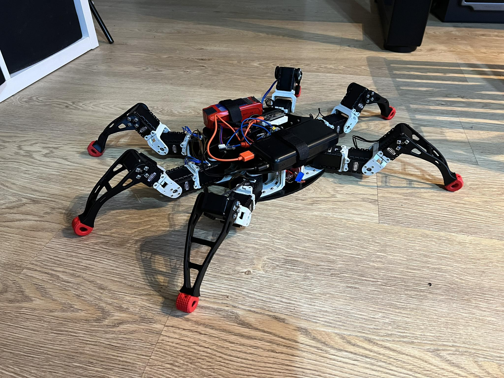
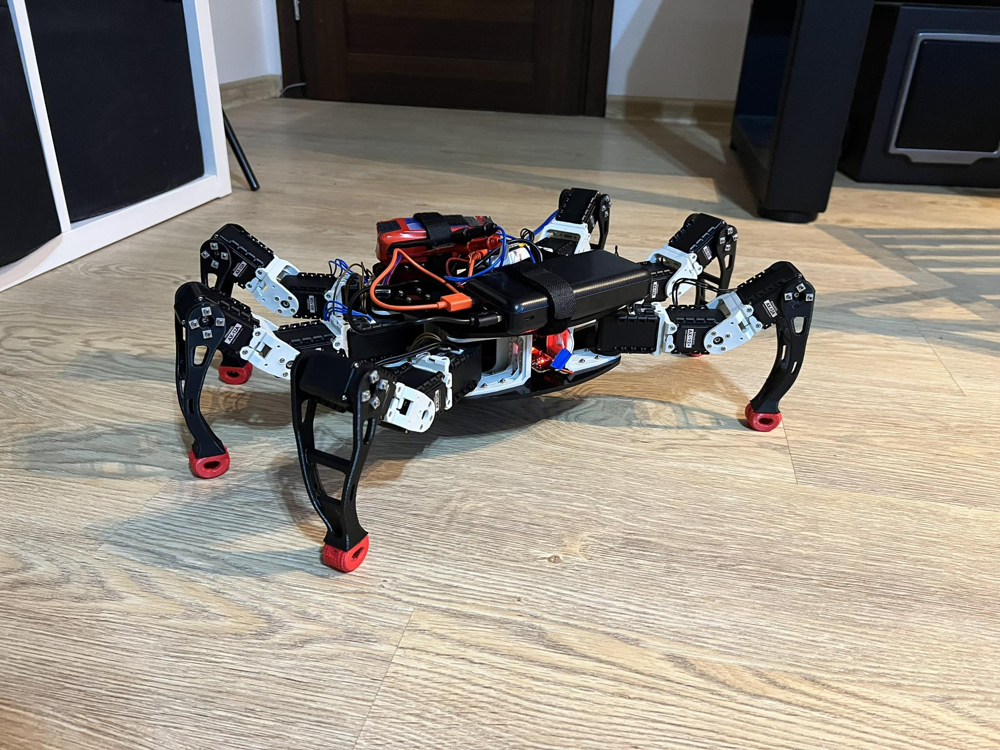

# HEXAPOD Robot 🤖🕷

  
  
   
  
  

---

## Wybierz swój język

<table align="center" text-align="center">
<thead><th align="center">

#### EN
</th><th>&emsp;</th><th align="center">

#### PL
</th></thead>
<tbody>
<tr><td align="center">

[Read the QuickStart Guide in English (EN)](./QUICKSTART_GUIDE_EN.md)

<!-- |README|QuickStart Guide|
|:-:|:-:|
|[Read the README in English (EN)](./docs/README.md)|[Read the QuickStart Guide in English (EN)](./docs/QUICKSTART_GUIDE_EN.md)| -->
</td><td>&emsp;</td><td align="center">

[Przeczytaj QuickStart Guide po polsku (PL)](./QUICKSTART_GUIDE_PL.md)

<!-- |README|QuickStart Guide|
|:-:|:-:|
|[Przeczytaj README po polsku (PL)](./docs/README_PL.md)|[Przeczytaj QuickStart Guide po polsku (PL)](./docs/QUICKSTART_GUIDE_PL.md)| -->
</td></tr>
<tr><td align="center">

[Read the README in English (EN)](../README.md)

</td><td>&emsp;</td><td align="center">

[Przeczytaj README po polsku (PL)](./README_PL.md)

</td></tr>
</tbody>
</table>

---

## Spis treści
* [O projekcie](https://github.com/revalew/HEXAPOD/blob/master/docs/README_PL.md#o-projekcie)
* [Postęp prac](https://github.com/revalew/HEXAPOD/blob/master/docs/README_PL.md#post%C4%99p-prac)
  * [Pierwszy sukces](https://github.com/revalew/HEXAPOD/blob/master/docs/README_PL.md#pierwszy-sukces)
  * [Pomyślne połączenie](https://github.com/revalew/HEXAPOD/blob/master/docs/README_PL.md#pomy%C5%9Blne-po%C5%82%C4%85czenie)
  * [Pierwsze powstanie](https://github.com/revalew/HEXAPOD/blob/master/docs/README_PL.md#pierwsze-powstanie)
  * [Sterowanie wszystkimi serwomechanizmami za pomocą kinematyki odwrotnej](https://github.com/revalew/HEXAPOD/blob/master/docs/README_PL.md#sterowanie-wszystkimi-serwomechanizmami-za-pomoc%C4%85-kinematyki-odwrotnej)
  * [Pierwsza przechadzka](https://github.com/revalew/HEXAPOD/blob/master/docs/README_PL.md#pierwsza-przechadzka)
  * [Nasz własny projekt nogi](https://github.com/revalew/HEXAPOD/blob/master/docs/README_PL.md#nasz-w%C5%82asny-projekt-nogi)
  * [Teleobsługa HEXAPODa za pomocą klawiatury (zdalne sterowanie)](https://github.com/revalew/HEXAPOD/blob/master/docs/README_PL.md#teleobs%C5%82uga-hexapoda-za-pomoc%C4%85-klawiatury-zdalne-sterowanie)
  * [Ulepszenie struktury kodu poprzez dodanie maszyny stanów robota](https://github.com/revalew/HEXAPOD/blob/master/docs/README_PL.md#ulepszenie-struktury-kodu-poprzez-dodanie-maszyny-stan%C3%B3w-robota)
  * [Bezprzewodowe sterowanie robotem zasilanym z baterii](https://github.com/revalew/HEXAPOD/blob/master/docs/README_PL.md#bezprzewodowe-sterowanie-robotem-zasilanym-z-baterii)
  * [Dodanie prywatnego punktu dostępu (*Access Point*)](https://github.com/revalew/HEXAPOD/blob/master/docs/README_PL.md#dodanie-prywatnego-punktu-dost%C4%99pu-access-point)
  * [Zwiększenie przyczepności](https://github.com/revalew/HEXAPOD/blob/master/docs/README_PL.md#zwi%C4%99kszenie-przyczepno%C5%9Bci)
* [Problemy i plany na przyszłość](https://github.com/revalew/HEXAPOD/blob/master/docs/README_PL.md#problemy-i-plany-na-przysz%C5%82o%C5%9B%C4%87)
  * [Bieżące problemy](https://github.com/revalew/HEXAPOD/blob/master/docs/README_PL.md#bie%C5%BC%C4%85ce-problemy)
  * [Przyszłe ulepszenia i plany rozwoju](https://github.com/revalew/HEXAPOD/blob/master/docs/README_PL.md#przysz%C5%82e-ulepszenia-i-plany-rozwoju)

## O projekcie
To jest repozytorium projektu akademickiego, który ja i moi przyjaciele rozwijamy. W żadnym wypadku nie jest on idealny, ale będziemy **CIĘŻKO** pracować, aby poprawić funkcjonalność i sprawić, by wszystko działało jak należy!

Co chcemy osiągnąć:

- Opracować funkcjonalny system sterowania dla robota typu **HEXAPOD**,
- Dowiedzieć się więcej o Raspberry Pi (np. komunikacja HALF-Duplex UART),
- Dowiedzieć się więcej o oprogramowaniu ROS2,
- Dowiedzieć się więcej o Dockerze i środowiskach konteneryzowanych,
- Lepsze poznanie robotyki (w szczególności kinematyki odwrotnej),
- Poznanie programowania OOP w Pythonie i ROS2,
- Dowiedzieć się, jak korzystać z Git i GitHub do współpracy.

## Postęp prac

### Pierwszy sukces:
Stworzyliśmy system sterowania w zamkniętej pętli wykorzystujący:
- Węzeł (*node*) publisher,
- Węzeł subscriber,
- ROS2 service,
- demo Turtlesim.

  

----

### Pomyślne połączenie:
Udało nam się skomunikować z serwomechanizmami i upewnić się, że wszystkie 18 z nich działa poprawnie! 🥳

  

----

### Pierwsze powstanie:
Po kilku próbach HEXAPOD może wreszcie z łatwością wstać! Wciąż pozostaje wiele do zrobienia, ale jesteśmy gotowi do migracji prototypowych skryptów Pythona do środowiska ROS2, aby kontrolować wszystkie serwomechanizmy jednocześnie (synchronicznie).

  

----

### Sterowanie wszystkimi serwomechanizmami za pomocą kinematyki odwrotnej:
Wiele godzin i iteracji później w końcu udało nam się wykorzystać możliwości ROS2 do poruszania wszystkimi nogami jednocześnie! Aby to osiągnąć wykorzystaliśmy:
- ulepszoną strukturę kodu - przenieśliśmy nogi do jednego pliku i stworzyliśmy osobne funkcje dla każdej nogi,
- niestandardowy interfejs, który jest w zasadzie tablicą pozycji dla serwomechanizmów,
- inną strukturę pakietów do sterowania serwomechanizmami - użyliśmy wbudowanej klasy DynamixelSDK o nazwie "GroupSyncWrite", aby zminimalizować liczbę wysyłanych wiadomości (teraz tylko 6!),
- plik startowy (*launchfile*), który uruchamia osobny proces dla każdej z nóg i dla ciała, pozwalając nam wykonywać je w tym samym czasie.

  
  &ensp;
  
   
  

----

### Pierwsza przechadzka:
Po chwili zmagań, w końcu zaimplementowaliśmy obliczanie trajektorii nogi przy użyciu odwrotnej kinematyki nogi i z powodzeniem dodaliśmy wzorzec chodu. Na razie używamy tylko jednego wzorca, ale w przyszłości możemy potrzebować ich więcej, więc przygotowaliśmy architekturę kodu dla tego scenariusza. Obecnie chcemy poprawić szybkość komunikacji UART, aby poruszać się szybciej lub zmienić mechanizm *publisher / subscriber* środowiska ROS na usługi (*services*).

Podsumowanie:
- zaimplementowano trajektorię nóg i wzorce chodu,
- dodano niestandardowe interfejsy, np. controll_status do monitorowania statusu robota w przyszłości,
- zmieniono architekturę kodu.

  
  

----

### Nasz własny projekt nogi:
Ze względu na problemy, jakie mieliśmy z obecną konstrukcją nóg, postanowiliśmy stworzyć nową. Nogi, których używaliśmy do tej pory, były bardzo śliskie, więc robot drgał i ślizgał się po całym stole. Nowy projekt ma na celu rozwiązanie tego problemu poprzez dodanie gumowych nóżek. Pierwszą rzeczą, którą wypróbowaliśmy, był projekt *generative design*, ale okazało się, że jest on bardzo trudny do wydrukowania przy użyciu naszej obecnej drukarki 3D i naszej ogólnej wiedzy na temat drukowania.
Następnie przeszliśmy do prostszego projektu, ale jak zawsze o czymś zapomnieliśmy, więc i tym razem projekt był wadliwy, ponieważ pozwalał na zmianę kąta tylko w zakresie 0-180 stopni.
Jednak szybko rozwiązaliśmy problem ograniczenia kąta. Zmieniliśmy długość listków mocujących nogę do serwomechanizmu i lekko zmodyfikowaliśmy kształt, dzięki czemu wszystko wygląda niesamowicie. Teraz możemy wypróbować je w prawdziwym życiu i zobaczyć, czy pomoże to rozwiązać problem braku tarcia.

  
  
   
  

----

### Teleobsługa HEXAPODa za pomocą klawiatury (zdalne sterowanie):
Po ulepszeniu algorytmu chodzenia, byliśmy w końcu w stanie wdrożyć teleoperacje robota HEXAPOD (zdalne sterowanie), a wyniki przerosły nasze oczekiwania. Wszystko poszło gładko i mogliśmy poruszać robotem za pomocą klawiatury. Możemy teraz kontrolować parametry, które definiują ciało (translacja i rotacja) oraz zmieniać kierunek, w którym chcemy chodzić. Najlepsze jest to, że możemy teraz łatwo łączyć chodzenie i zmianę pozycji ciała! Dzięki temu możemy chodzić z obróconym ciałem lub przechodzić nad/pod różnymi obiektami. Był to również pierwszy prawdziwy test naszej nowo zaprojektowanej nogi i teraz wiemy, że... musimy ją przeprojektować, ponieważ silikonowe stopy nie są ustawione pod odpowiednim kątem. Nóżki są również bardzo sztywne, więc chcemy zająć się też tym problemem. Mamy także inny pomysł na poprawę kształtu nogi, więc w nadchodzących tygodniach będziemy testować wiele różnych rzeczy.

  
  

----

### Ulepszenie struktury kodu poprzez dodanie maszyny stanów robota
Po zmaganiach ze strukturą kodu, zdecydowaliśmy się na implementację maszyny stanów.  W tej chwili zaimplementowaliśmy tylko podstawową funkcjonalność, ale planujemy ulepszyć ten pomysł w przyszłości. Dodaliśmy następujące stany:
- idle - zatrzymanie robota i oczekiwanie na zmianę stanu (następne polecenie),
- walk - rozpoczęcie chodzenia w danym kierunku,
- rotate_left - rozpoczęcie obracania robota w kierunku przeciwnym do ruchu wskazówek zegara,
- rotate_right - rozpoczęcie obracania robota zgodnie z ruchem wskazówek zegara,
- torque_enable - włączenie momentu obrotowego na każdym serwomechanizmie,
- torque_disable - wyłączenie momentu obrotowego na każdym serwomechanizmie,
- body_manipulation - zatrzymanie i przełączeni w tryb zmiany pozycji ciała (translacja i rotacja).

Dzięki tej koncepcji maszyny stanów byliśmy w stanie 9-krotnie poprawić szybkość transmisji danych, co poprawiło również synchronizację serwomechanizmów (działają synchronicznie) i ustabilizowało ciało podczas chodzenia.

----

### Bezprzewodowe sterowanie robotem zasilanym z baterii
Na poniższych gifach widać, że udało nam się zaimplementować odwrotną kinematykę w taki sposób, że możemy zmieniać translację i rotację ciała podczas chodu. Tym razem dodaliśmy również możliwości bezprzewodowe, teraz robot nie musi być stale podłączony do sieci - działa na bateriach i jest sterowany zdalnie za pomocą klawiatury. Następny krok - kontroler Xbox.

  
  
   
  

----

### Dodanie prywatnego punktu dostępu (*Access Point*)
Tym razem dodaliśmy mikrokontroler ESP8266, aby działał jako punkt dostępu dla naszego robota i laptopa, więc teraz możemy zabrać HEXAPODa na dłuższy spacer poza nasz warsztat! To może nie wydawać się wiele, ale pomogło nam to zaimponować Opiekunowi Projektu na uczelni, gdy robot sam wszedł do jego biura 😎.

----

### Zwiększenie przyczepności
Dzięki nowo zaprojektowanym i wydrukowanym w 3D nogom, udało nam się zwiększyć tarcie nóg. A dokładniej dzięki gumowym "podkładkom" (stopom), które uginają się pod ciężarem robota, dodatkowo zwiększając tarcie. Zaowocowało to dokładniejszą trajektorią chodu całego robota. Można teraz powiedzieć, że robot chodzi stabilnie i prosto. Problem ślizgających się nóg został rozwiązany!

  
  

----

## Problemy i plany na przyszłość

### Bieżące problemy:
- Brak bieżących problemów. Praca nad nowymi funkcjami.

### Przyszłe ulepszenia i plany rozwoju:
- zmiana części mechanicznych, np. drukowane mniej śliskie stopy za pomocą drukarki 3D (✅),
- teleoperacja za pomocą klawiatury (✅),
- teleoperacja za pomocą kontrolera Xbox (❌),
- dodanie ESP8266 jako prywatnego punktu dostępu, aby stać się w pełni mobilną platformą (✅),
- zmiana *roll and pitch* ciała podczas chodzenia (✅),
- obracanie się gdy robot stoi w miejscu (✅),
- obracanie się w trakcie chodu (❌),
- implementacja czujnika IMU i kompensacji przechyłu ciała (❌),
- optymalizacja kodu (❓),
- szybsza komunikacja (✅),
- skanowanie otoczenia za pomocą LIDAR - mapowanie pomieszczeń (❌),
- pełna autonomiczność (samouczący się system nawigacji w pomieszczeniu z omijaniem przeszkód) (❌).
